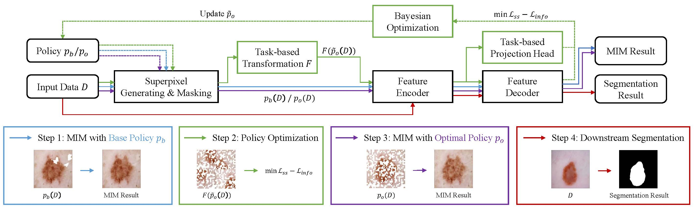

# *auto*SMIM
By Zhonghua Wang*, Junyan Lyu*, Xiaoying Tang.

This repository contains official PyTorch implementations of the following papers 
* ["Superpixel inpainting for self-supervised skin lesion segmentation from dermoscopic images"](https://ieeexplore.ieee.org/document/9761620), ISBI 2022
* ["*auto*SMIM: Automatic Superpixel-based Masked Image Modeling for Skin Lesion Segmentation"](https://ieeexplore.ieee.org/document/10168139), TMI 2023



## Quick start

### Environment

The code is developed using Python 3.8.16 and Pytorch 2.0.0 on CentOS 7 with NVIDIA GPUs. Training and testing are performed using 4 NVIDIA RTX 3090 GPUs with CUDA 11.7. Other platforms are not fully tested. 

### Install

Main dependencies: Pytorch, Pytorch Lightning, WandB, Microsoft NNI. You can directly install the dependencies by running: 

```
pip install -r requirements.txt
```

Note: If you want to use WandB to log your experiment results, you should have a free account of WandB. The experiment results will be automatically uploaded. For more information please refer to [section below](#about-logging-experimental-results). 

### Data

Please download [ISIC datasets](https://challenge.isic-archive.com/data/) and [Ham10000](https://www.kaggle.com/datasets/kmader/skin-cancer-mnist-ham10000). After downloading the datasets, please change the function `load_name` in corresponding file in directory `datasets` to your data storage path (annotated with 'need modification'). 

### Configs

Please refer to the configuration file in directory `configs`. All the training configurations can be done by changing the specific parameter in config file. 

There are five config files in total. 
* `config.yaml`: This config is used for original segmentation 
training and testing. 
* `config_inpainting.yaml`: This config is used for MIM training and testing. Note: In this config file, parameter `inpainting` should be always set to be `True`. You should also change the parameters `aug_k` and `aug_n` to specific value in the policy.
* `config_search.yaml`: This config is used for policy searching. Note: In this config file, parameter `optimization` should be always set to be `True`. 
* `nni_config.yaml`: This config is used for nni setting. Here you can change the parameters of Bayesian Optimization experiments. I recommend only changing `experimentName`, `trailConcurrency`, `maxTrialNumber` and `maxExperimentDuration` to your own setting. For more information about these parameters, please follow the offical website of [Microsoft NNI](https://github.com/microsoft/nni). 
* `space.json`: This config is used for policy search space setting. By default, the searching space is $[40, 1000]$ for $k$ and $[1, 500]$ for $n$. You can also specific another searching space for more experiments.

### Train and test

After successfully prepare your code, environment and dataset, you can start your training. The training could be separated in four steps:

* Training MIM, rotation, colorization and jigsaw model using base policy. 

  You can do this training by running:

  ```
  python run.py --cfg ./configs/config_inpainting.yaml
  ```
  The policy is controlled by parameter `aug_k` and `aug_n`. By default, the value of `aug_k` and `aug_n` is $[512, 128]$. You can change the value to your own.

* Policy optimization.

  With config file set correctly, this step is simply done by running: 

  ```
  nnictl create --config ./configs/nni_config.yaml --port 8080
  ```

  The policy optimization is implemented using [Microsoft NNI](https://github.com/microsoft/nni). For customize usage of nni, please refer to its official repo. 

* Training MIM model using optimized policy obtained in step 2. 

  This is the same as the process in step 1. The only change is that you should change the value of `aug_k`, `aug_n` to optimized policy value in step 2. The command is the same as in step 1.

* Downstream segmentation model training. 

  After obtaining a new MIM model using optimized policy, you can use the MIM model for segmentation. By setting the `pretrained` value in the config file `config.yaml`, you can directly load the MIM model for training segmentation model. Then directly run
  ```
  python run.py --cfg ./configs/config.yaml
  ```

## (Optional) About superpixel generating

When training MIM model, we will need to generate superpixels for each image. This process is done automatically when loading image in dataloader. However, this will slow down the whole process since it needs to generate superpixel map for each image repeatedly. 

If you want to speed up training, you can generate superpixel map before training and store the map in the directory of corresponding dataset. You can do this by running `sp_generation.py` in directory `datasets`. 
```
python sp_generation.py
```
Here you should change the parameter `corneal_list` to your dataset storage path and change the parameter `sp_num` and `size` to specific data size and superpixel generated for each image. After doing so, the superpixel map will be automatically loaded from the directory of corresponding dataset when loading the dataset.

## (Optional) About logging experiment results

The results of the experiments could be automatically uploaded to WandB. If you want to have the results uploaded, you need to create a free account of WandB. Please refer to their [official website](https://wandb.ai/site). 

After getting a free account and sign in successfully, you can change the information in `run.py` to your own to log results automatically. If you don't want to use WandB, you can directly change the value of `smoke_test` in config file to `True`. 

## Citation
If you find this repository useful, please consider citing the following papers:

```
@ARTICLE{10168139,
  author={Wang, Zhonghua and Lyu, Junyan and Tang, Xiaoying},
  journal={IEEE Transactions on Medical Imaging}, 
  title={autoSMIM: Automatic Superpixel-based Masked Image Modeling for Skin Lesion Segmentation}, 
  year={2023},
  volume={},
  number={},
  pages={1-1},
  doi={10.1109/TMI.2023.3290700}}

@inproceedings{wang2022superpixel,
  title={Superpixel inpainting for self-supervised skin lesion segmentation from dermoscopic images},
  author={Wang, Zhonghua and Lyu, Junyan and Luo, Wenhao and Tang, Xiaoying},
  booktitle={2022 IEEE 19th International Symposium on Biomedical Imaging (ISBI)},
  pages={1--4},
  year={2022},
  organization={IEEE}
}
```
